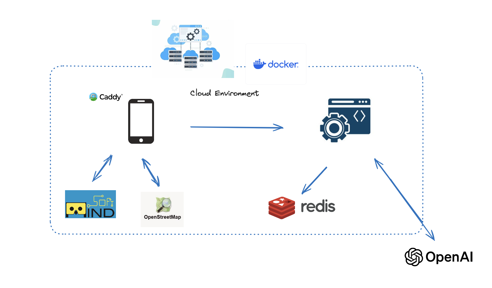

# Grab ARcade


## Overview



This repository contains two primary components:

1. Backend: An ExpressJS application that uses EJS for templating, Redis as a database, and OpenAPI for text-to-text and text-to-image generation.

2. Frontend: A TypeScript-based application using Vue.js, Caddy, MapLibre, MindAR, Carto Map, OpenStreetMap, Naive-UI, and TurfJS.


The project is containerized using Docker and orchestrated with Docker Compose, and it is deployed on a VPS.

## Getting Started
### Prerequisites
- Docker: Ensure Docker is installed on your machine.
- Docker Compose: Ensure Docker Compose is installed on your machine.

### Setup
1. Clone this repository:
    ``` 
    git clone https://github.com/rigmas/crazy-code.git
    cd crazy-code
    ```
2. Build and start this application
    ```
    chmod +x start.sh //only for the first time you start the app
    ./start.sh
    ```
    This command will build the docker images and start the containers as defined in the docker-compose.yml file.

3. Stop the application
    ```
    chmod +x stop.sh //only for the first time you stop the app
    ./stop.sh
    ```

### Configuration
  - Backend
      - The backend service is configured to run on port 3000 (configurable in docker-compose.yml).
      Redis is used as a cache database, ejs use for rendering html template, and API endpoints are defined in the ExpressJS application.
      - The backend application includes features from openAPI (dall-e-3 and chatGPT 4)
  
  - Frontend
      - The frontend service is configured to run on port 4001 (configurable in docker-compose.yml). 
      - The frontend application includes various features such as AR services, mapping, and geolocation.


### Accessing the Application
- Frontend: Open your browser and navigate to http://localhost:4001 to access the frontend application.
- Backend: The backend API can be accessed via http://localhost:3000.


## Deployment
This application is already deployed to the cloud,
you can find it in this link https://crazy-code.sahito.no/merchant (for merchant)
and https://crazy-code.sahito.no (for user)
